# Secure Steganography Platform

A secure-by-default FastAPI platform for encrypting, embedding, extracting, and verifying payloads in PNG images, with authentication, object-level authorization, hostile-file handling, audit logging, DevSecOps automation, Azure deployment, and reproducible security benchmarks.

> **Steganography conceals the presence of a message. It does not replace encryption. Payloads are encrypted and authenticated before embedding.**

## Features

- Encrypt-then-embed pipeline: scrypt KDF → AES-256-GCM → versioned binary envelope → pseudorandom LSB embedding
- JWT authentication (15-min access tokens) with rotating refresh tokens and replay-detection family revocation
- Argon2id password hashing, account lockout, and object-level authorization
- Hostile-file validation: magic bytes, dimension limits, pixel-bomb guard
- Async job queue for embed / extract / verify operations
- Admin API for user management (metadata only — no access to payloads or keys)
- Tamper-evident audit log with hash chain (Phase 3)
- Dockerized, with full Azure deployment via Terraform

## UML Diagrams

### Use Cases

**User**



**Admin**



**Includes**



### Misuse Cases

**External Attacker**



**Insider Threats**



### Class Diagram

[Core Entities Class Diagram](docs/uml/class_diagram_core_entities.html)

## Cryptographic Design

Encrypt-then-embed: scrypt key derivation (fresh 16-byte salt) → AES-256-GCM (fresh 12-byte nonce) → versioned binary envelope → key-seeded pseudorandom LSB embedding (PCG64 pixel permutation).

The fixed 46-byte header (magic, version, KDF params, salt, nonce, length) is embedded sequentially so the extractor can recover salt and length before needing the permutation key. The ciphertext region is then scattered across pixels using the permuted layout.

PNG is lossless and suitable for deterministic LSB embedding. JPEG is excluded because lossy recompression destroys embedded content.

See `docs/cryptographic-design.md` for full details.

## Authentication and Authorization

- **Passwords:** Argon2id via argon2-cffi
- **Access tokens:** HS256 JWT, 15-minute lifetime, minimal claims (sub / role / iat / exp / jti)
- **Refresh tokens:** opaque, hashed at rest, rotated on every use — replay detection burns the entire token family
- **Account lockout:** configurable failed-attempt threshold and lockout window
- **Authorization:** object-level ownership checks on every job route — users never see each other's data
- **Generic errors:** login and registration failures use identical responses to prevent user enumeration

## File-Upload Security

Every uploaded file is validated before processing: magic bytes are checked against the declared content type, image dimensions are bounded, and decompression-bomb payloads are rejected. A fresh output image is written on embed, stripping all source metadata chunks.

See `docs/secure-file-processing.md`.

## Embed and Extract Workflow

1. Client uploads a PNG and passphrase via `POST /api/v1/jobs/embed`
2. Server validates the file, derives a key from the passphrase, encrypts the payload with AES-256-GCM, and embeds the envelope into the image using pseudorandom LSB placement
3. Client retrieves the stego-image from the completed job
4. To extract, client posts the stego-image and passphrase to `POST /api/v1/jobs/extract`
5. Server reads the sequential header, re-derives the key, decrypts and authenticates the ciphertext — any tampering fails the GCM tag check
6. `POST /api/v1/jobs/verify` performs structural validation without a passphrase — it confirms envelope presence but cannot verify payload integrity without the key

## Security Goals

- Payload confidentiality: AES-256-GCM with per-embed fresh key material
- Payload integrity: GCM authentication tag — any bit flip is detected on extract
- Authentication: short-lived JWTs with rotating refresh tokens
- Authorization: no cross-user data access at any layer
- Audit: tamper-evident hash-chained log of all security events (Phase 3)
- Hostile-input resistance: file validation before any crypto or image processing

## Non-Goals

This project does **not** claim: undetectable communication, anti-forensic capability, monitoring evasion, anonymity, production readiness without independent review, or resistance to steganalysis.

## DevSecOps Pipeline

GitHub Actions workflows cover:

- `ci.yml` — lint, type-check, full test suite on every push
- `codeql.yml` — static analysis
- `container-scan.yml` — image vulnerability scanning
- `dast.yml` — dynamic application security testing
- `deploy-staging.yml` — deploy to Azure Container Apps on merge to main
- `terraform.yml` — Terraform plan/apply for infrastructure changes

## Azure Architecture

Deployed to Azure Container Apps with:

- Azure Container Registry for image storage
- Azure Database for PostgreSQL (Flexible Server) via private DNS
- Azure Blob Storage for processed files
- Azure Key Vault for secrets
- Azure Front Door + WAF for ingress
- Azure Monitor + Application Insights for observability
- Defender for Cloud for security posture

See `docs/azure-deployment.md` and `terraform/` for full infrastructure definitions.

## Benchmark Results

See `docs/benchmark-results.md`.

## Setup

```bash
cp .env.example .env
docker compose up --build
# API: http://localhost:8000/docs
```

## Running Tests

```bash
pip install -r requirements.txt -r requirements-dev.txt
pytest --cov=app
```

## Demo

See `docs/demo-script.md`.

## Known Limitations

See `docs/known-limitations.md`.

## Disclaimer

This project is an educational secure-software-engineering reference implementation using synthetic test data only. It is not intended for covert exfiltration, evasion of monitoring, or production deployment without independent security review. Steganography does not guarantee undetectability and does not replace encryption.
